# WHISIT

## Purpose
***WHISIT*** (WHere IS IT) is a Matlab-based program developed to identify bacteria and measures the fluorescent signal in different compartments. It can do this on a set of independent microscopy pictures, or on a movie and trcking cells to follow the signal through multiple generations and cell-lines.

#### Background
There are several programs for the analysis of foci and count numbers of spots in bacterial cells. However, few addresses how signal is distributed inside bacterial cells using a high-throughput and quantitative approach. For this reason the program WHISIT was created: for high-throughput quantification of fluorescent signal, specifically in into different areas of cells (e.g., membrane, cytosolic and polar compartments), rather than simply giving the average intensity value (as it is done by most software). Lastly, WHISIT can plot the fluorescence signal of related cells tracked in time lapse as a lineage tree, allowing for quantifying intergenerational changes. 

In the following guide, we will explain how the program works and how to use it. WHISIT was created to be easy to use and no knowledge of programming is required, since it works with a graphic user interface (GUI). Results are created in a user friendly format accessible via Excel or any other similar spread-sheet program. In the last section, we will illustrate an outlook for the program and future improvements.

| 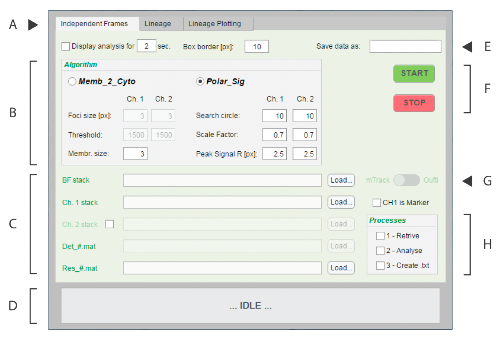 
| --- |
| <u>Figure 1</u> – *Overview of the GUI of WHISIT*, specifically the first tab “Independent Frames”. The indicated area are are: (A) the tabs for the different processes, (B) the panel for the algorithms and parameters of analysis, (C) section for loading input files and image stacks, (D) panel to display status of operations, (E) rename output files, (F) start and stop buttons, (G) choose origin of the detection file (MicrobeTracker or Oufti), (H) processes to perform with the data. |

## Overview
The program is divided into three GUI tabs, selectable in the upper part of the window (see [Figure 1](Guide_Figures/WHISIT_GUI.png)). 
- ***Independent frames*** perfom the analysis of a stack of independent images. This is the best approach when the experiments are a collection of snapshots/frames and each cell in every frame will be considered an independent entry in the results. 
- ***Lineage*** tab performs the analysis of time lapse images. This function track the changes in individual cells over time, tracking them across multiple frames. The stack of images are assumed to be from a time lapse or movie. This approach follows the changes occurring across generations, storing the information of divisions and relationships in order to re-create lineage trees. 
- ***Plot Lineage*** tab generate plots using the results from the "Lineage” analysis. The plots display changes in fluorescence over generations as a lineage tree. WHISIT can analyse up to two fluorescent channels at a time for a given experiment.

## 0 – MicrobeTracker or Oufti?
WHISIT works side-by-side and uses the “detection” output file generated by either MicrobeTracker or Oufti: 
- **MicrobeTracker** (http://microbetracker.org/, Sliusarenko, O. et al., 2011)  
- **Oufti** (http://oufti.org/index.html, Paintdakhi, A. et al., 2016). 
Both programs are Matlab-based and their core algorithm take stacks of bright field images and identify the bacteria perimeters in each single picture. These programs yields output files that contains sets of coordinates for each cell perimeter, as well as other parameters that define each cell in each picture. That is where WHISIT pick up and continues with our implementation of the analysis of fluorescent signal distribution.
*Oufti* is the upgraded version of *MicrobeTracker* and therefore its use is recommended. Oufti has a superior cell identification algorithm, greater flexibility in the parameters chosen for analysis and is less prone to detection errors.
A file is generated at the conclusion of the analysis of either program, in the Matlab format “.mat”. WHISIT can use the result generated by either of MicrobeTracker or Oufti: select from which program the *Detection.mat* was generated at point G in [Figure 1](Guide_Figures/WHISIT_GUI.png). 

#### Format of input images
A stack of bright field images is given as input in “Independent frames” analysis. This approach will consider each frame unrelated from the other and identify any cell within it (in the Matlab format “.mat”). The area of fluorescent signal for a cell can be slightly bigger than the area occupiedy in the bright field image. Using stringent or wrong parameters for cell detection could result in cells having a perimeter cut off part of the fluorescent signal. Experiment with a range of parameters in the detection of MicrobeTracker/Oufti to find the correct detection parameters that allow to include the fluorescent signal correctly. Each microscope and setting can change the acquisition and quality of bright field images, requiring adjustment during detection. Moreover, a good alignment of the fluorescent and bright field images is necessary. WHISIT does not account and cannot correct for possible shifts! The path to the folders containing the stack of images, for bright field and one to two fluorescent channels, can be loaded in the GUI at ***area C*** in [Figure 1](Guide_Figures/WHISIT_GUI.png). In ***area C*** it is also loaded the *Detection.mat* and the *ExpN_1_DB.mat* file created by Outfi/MicrobeTracker.

### 1 - Independent Frames Analysis - How to use it 
In the Algorithm panel, several parameters can be chosen. The first it is to choose which algorithm to use to analyse the images: ***Memb_to_Cyto***, which analyses the distribution of fluorescent in cytosol and membrane; or ***Polar_Sign***, which analyses the distribution of fluorescent specfically at the poles of cells. 

| 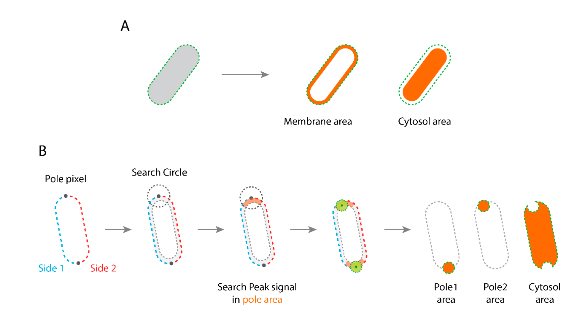 
| --- |
| <u>Figure 2</u> – A schematic representation of the main steps that the program used to create masks for the different cell compartments. In (A) is shown the algorithm **Memb_2_Cyto**, while in (B) is shown the algorithm **Polar_Sig**. |

#### Parameters for analysis
Several parameters are available to tune the analysis.
- The algorithm ***Memb_to_Cyto*** divides the interior of cells in two compartments for analysis (see [Figure 2](Guide_Figures/Algorithms.png)). The “membrane area” extend inward from the perimeter of a cell, with a specific thickness (Membrane size). The remaining area is defined as “cytosol area”. This algorithm also identifies clusters of signals that are used to make a cross-section of cells and saves the signal profile at this specific positions. Two editable parameters allow for choosing the criteria for selection of clusters of signal. 
NOTE: We named these signal clustering “foci” for simplicity, but we do not use the word “foci” in the classical definition, as round spot of signals. Here with “foci” we are considering a clusters of signal above a specific signal threshold level. Since the shape is not important, so they may have any shape.
	- **FOCI SIZE**: this value determines the minimal area (in pixels) that foci must have to be evaluated. Belowsuch threshold, detected objects are considered noise and discarded.
	- **THRESHOLD**: this is the minimum threshold for pixels value. Above such a value the pixels (and if they are above the foci size) the object are examined for patterns and clustering. NOTE: if this value is too high, no foci will be detected and the relative output file will be empty.
	- **MEMBRANE SIZE**: this value defines the distance (in pixel) by which the membrane area extend from the perimeter of theas detected in MicrobeTracker/Oufti). N.B.: although the membrane is physically at most few tens of nanometers, the emission of fluorescent signals is often about 400-700 nm. This should be considered to cover the membrane area correctly. Recommended values are around one to three.

- The algorithm ***Polar_Sig*** divides the interior of cells in three compartments for analysis (see [Figure 2](Guide_Figures/Algorithms.png)) . A search area is created as the intersection between a circle whose center is at the pole and the “membrane area”. Within this area (see [Figure 2](Guide_Figures/Algorithms.png)) the program search for the brightest pixel. Using this pixel as center, a circle is drawn proportionally to the search circle. This will define the pole areas. The cytosol area is the remaining area once the pole areas are subtracted. Three additional parameters are related to this algorithm and define criteria to create polar areas.

	- **SEARCH CIRCLE**: create a circle whose center is located at the polar pixel. The radius (in pixels) is defined by the user.
	- **PEAK SIGNAL**: threshold to consider for selecting the brightest pixel within the area defined by the “membrane area” and the “Search circle”.
	- **SCALE FACTOR**: this defines the radius of the circle created with the brightest pixel at its center. The radius is proportional to the "Search circle". The value range is from 0 to 1. 

- There are two more general options available in WHISIT:
	- **DISPLAY ANALYSIS**: shows a series of plots to check the results produced by the analysis. The result for each single cell is displayed, with several passages and the final “Masks” defining the different areas of the cell. These steps aid to give a visual feedback on the ongoing analysis and to choose the right parameters. NOTE: from the computational point of view, this can be the most time consuming step. Skip if you want to speed things up
	- **BOX BORDER**: when analysing fluorescence images, a cropped image of each cell is create and stored in the results. The data created is therefore not only a database of numbers, but also contains all the images related to each cell. This value determines the extra border to add to a cropped image of single cells. It does not change analysis results, but should be at least >10 pixels. NOTE: if a cell is located close to the border of a frame, there can be error in analysis. It is recommended to exclude cells during cell detection in MicrobeTracker or Oufti, which are closer than the box border distance.

#### Algorithm steps – quick overview
The main algorithm proceed in three separate steps that run as follow:
1. **RETRIEVE CELLS**: retrieves the cells detected from the analysis file *Detection.mat*. Data is reorganized in a new format and named *ExpN_1_DB.mat*. This file is necessary for the next step (Analysis) and has no back compatability with MicrobeTracker or Oufti.
2. **ANALYSE**: initiates analysis of the fluorescent signal using the algorithm and parameters selected. *ExpN_1_DB.mat* file and stack of images (bright field, channel 1 and channel 2) are provided as inputs. *ExpN_1_DB.mat* remain unchanged and a new output file *ExpN_2_DB.mat* is created.
3. **CREATE.TXT**: generates Excel file(s) that report the main results (see section Output File Format for details).
NOTE: Saving the output files can take some time, during which WHISIT may appear frozen. This depends on the number of cells and frames analysed.

To summarize, the output file created are the following:
- *ExpN_1_DB.mat*: the intermediate file after “Retrive cells” process. Since it is not changed during analysis, it can be reused to generate a new analysis using different parameters.
- *ExpN_2_DB.mat*: it has all the content of *ExpN_1_DB.mat* plus all the results created during analysis of the fluorescent images. Can be accessed using Matlab to perform further analyses if wished.
- *ExpN_txt*: this is a report file that can be opened with Excel and easily performs statistics and draws chats of the results. For more details on the data structure see the Output File Format section. The algorithm **Memb_2_Cyto** generates <u>two</u> of such files, while the algorithm **Polar_Sign** generate only <u>one</u> file.
	- NOTE: *ExpN* can be any name assigned in the **field E** [Figure 1](Guide_Figures/WHISIT_GUI.png). The STOP button can be used at any point during second step “Analyse”. If it is pressed it will interrupt the analysis. However, data analysed will be lost. If you push START, it starts all over from the first cell. Data is saved only at the end of the step analysis.

##### Algorithm steps **Memb_to_Cyto** 
| **Figure** | **Description** |	
| --- | --- |
| 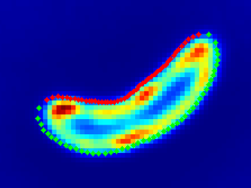 | The cell outline identified in the bright field image is used as a mask to isolate the fluorescence signal of the specific cell. A cropped image of the cell of interest is generated and used for all subsequent calculations. |
| 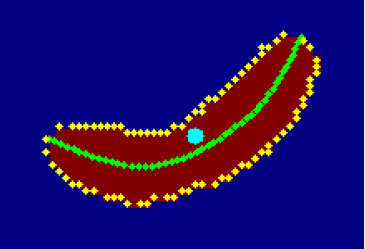 | The perimeter of a cell is converted in a set of pixel coordinates (yellow points). The cell longitudinal axis of a cell and the area are some of parameters calculated. |
| 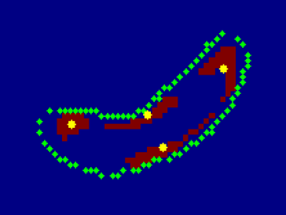 | The next step involves identification of signal clusters (foci) using Signal threshold and Foci size as criteria. For each of those clusters a mask is generated and stored. Later each mask can be used to calculate the average signal intensity, areas, etc… |
| 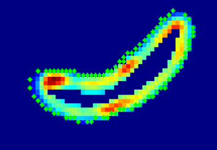 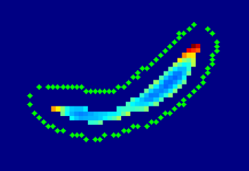 | The algorithm then identifies the membrane (right picture) and cytosol area (left picture. The program generate masks that define the two areas. Those mask are then used to calculate the fluorescent signal in each specific compartment The Membrane size is the main parameter that defines the extent of those areas. |
| 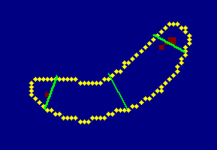 | For each foci a profile line (in green) is created. This line runs through the center of the foci and is orthogonal to the cell axis. The profile line is an array of pixel values for the fluorescent signal where the line passed. This create signal profile at those position that can be plotted. |

##### Algorithm steps **Polar_Sig**
| **Figure** | **Description** |	
| --- | --- |
| 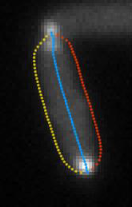 | The cell outline identified during detection is superimposed to the fluorescence channel. The cell coordinates are divided in two side (yellow and red points). The blue line is the cell axis |
| 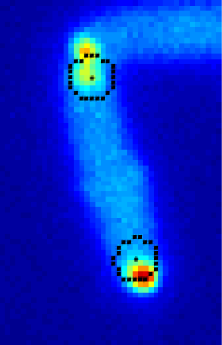 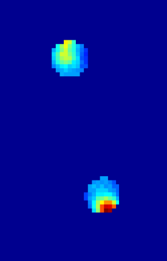 | At the extremities of each pole a circle is drawn (in black, right picture). This is then used to isolate each pole and in each area the algorithm search the pixel with the highest intensity value (left picture). |
| 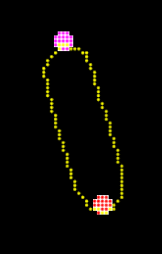 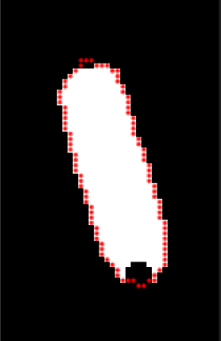 | From the highest intensity value a smaller circular area is drawn and will define the mask for each pole. The picture on the left shows the two polar mask (magenta and rec) together, and in yellow the cell outline is represented. In the picture on the left is shown the mask for the cytosol, minus the poles. |

### 2 - Lineage and Lineage Plot
The ***Lineage*** function tab is very similar to the “Independent Frames” tab (see [Figure 3](Guide_Figures/Tab_3.png)).

| 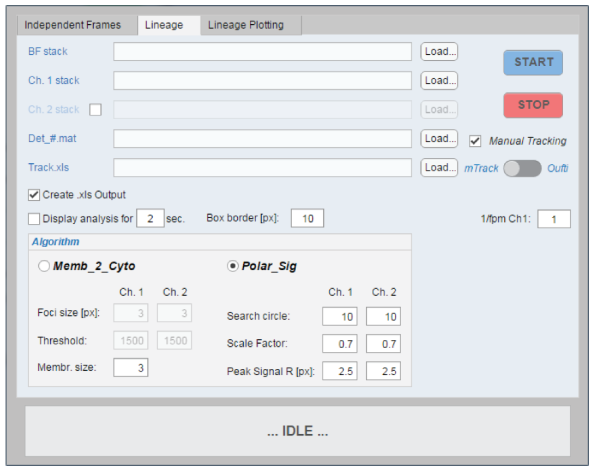 
| --- |
| <u>Figure 3</u> – The tab GUI for the “Lineage” tab. The above described parameters and options applies here as well. |

Algorithm, parameters and options for the most part are shared. There are two differences: the algorithm works in a single step (the “Lineage” function itself is just one script) and it requires as input an additional file containing the tracking of cells. This file is a list of tracks, where each track is a set of xy-coordinates of the position of a given cell in all the frames it appears in a time lapse. Fior example, this file can be created manually by the user, i.e. using the *mTrack* plugin of <u>**ImageJ**</u>.

Provided the inputs parameters, the list of tracks and *Detection.mat* the program can start analysis and at in the end provides a single result file. This is a list where each entry is a <u>***cell lineage***</u>, the results of the analysis on fluorescence as well as organizing cells and their relationships to each others through time.

| 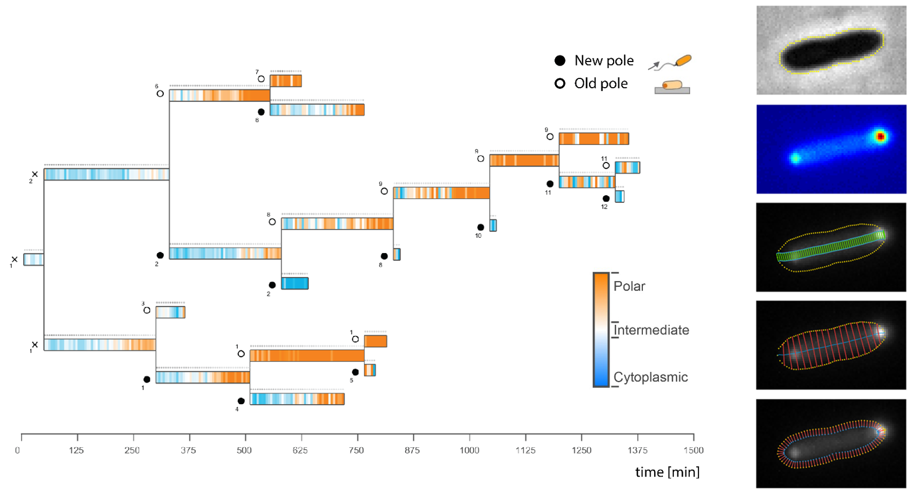 
| --- |
| An example of a cell lineage plot. |
 
  
 
| 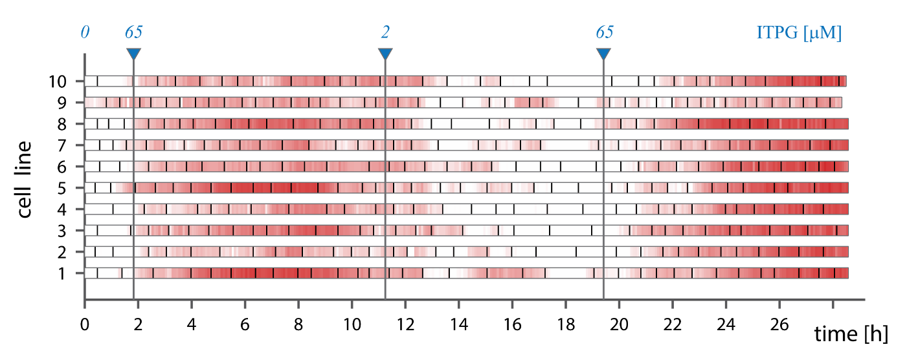 
| --- |
| Another example of analysis of florescent change in cell lineages within the mother-cell microfluidic device. |
